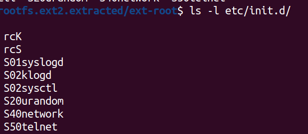
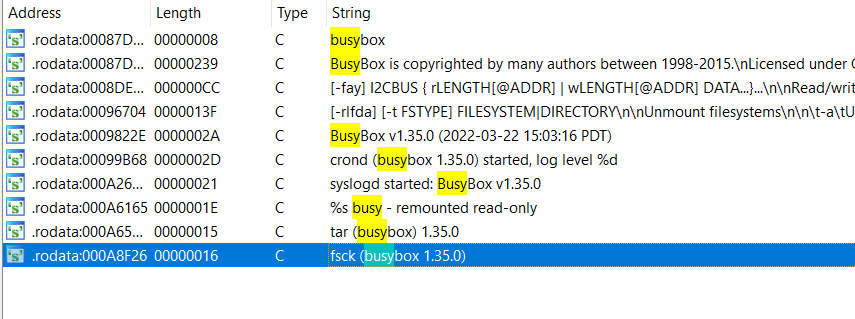
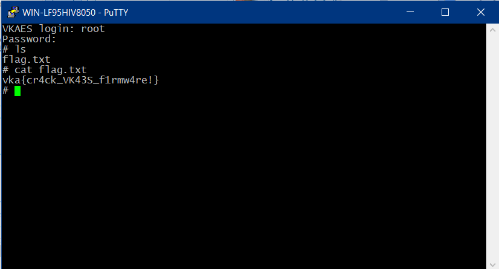

# Embeded System

|   Cобытие   | Название | Категория | Сложность |
| :---------: | :------: | :-------: | :-------: |
| VKACTF 2022 |  Чудо-прошивка  |  Обратная разработка  |  Средняя  |

## Описание

>Автор: [Rex]
>
>Выйдем братцы в поле
>По Сварожьей воле
>Дабы год был урожайным
>Будь готовым к бою
>
>Время жатвы нелегко,
>Если видишь ты её,
>Ту что души ваши в поле
>Собирает каждый год
>
>Есть у той беды-девицы,
>Интерфейс терминалицый,
>Коли ты его подключишь,
>Да войдя рута получишь
>
>Флаг откроется тебе,
>И введя его в окне,
>Сможешь поинты набрать,
>Славу Одину воздать

``` telnet 176.118.164.39 23230 ```

>[Yandex](https://disk.yandex.ru/d/2ZO85T4NI6hw5w)
[DropMeFiles](https://dropmefiles.com/cpu9C)

# Решение

Шо нам дано:

1)

2)

Порт 2323 открыт для подключения по telnet. Пробуем подключиться к сервису и видим, что нас встречает окно ввода логина и пароля. Значит нам придется его искать

Разбираем rootfs.ext2 с помощью **binwalk** и прежде всего идем в **/etc/shadow** 


Грусть, печаль, тоска, хеш потерли перед тем, как нам дали образ

Проверим, что у нас запускается при старте системы



Изучив содержимое **init.d** делаем вывод, что на нашей прошивке реально запущен системный телнет, а вот он уже входит в состав **busybox**-а

Конечно можно копаться во всем бинаре, но давайте попробуем посмотреть версию busybox и найти сорцы, чтобы ускорить процесс реверса



Идем [сюда](https://www.busybox.net/) и скачиваем необходимую версию (**1.35.0**)

Предлагаю для изучения воспользоваться **Understand Sci-Tools**. Достаточно удобно видеть графы вызова функций, переходить по нужным ссылкам (хотя понятно, что это есть везде)...в общем, рекомендую хотя бы попробовать)


Глянем на сорцы, связанные с telnetd.c, дальнейшие связи с проверкой пароля можем найти в libbb.h, correct_password.c

Берем строки, которые будут валяться в используемых функциях и начинаем прогонять, параллельно смотря одним глазом в Understand, а другим в IDA


Проходя путь проверки видим следующий код


Подключаемся по telnet, вводим пароль **0p3n**, и делаем долгожданное cat flag.txt



### P.S. 

Ну или если вы сначала проверяете файл на наличие флага, а потом запускаете тест прошивки (а все туда льется и льется), то вы Ванька-дурак, собственно как и разраб. таска

### Флаг

```
vka{cr4ck_VK43S_f1rmw4re!}
```